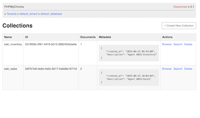
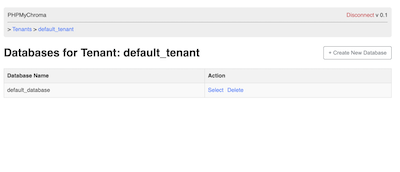
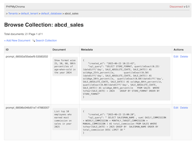
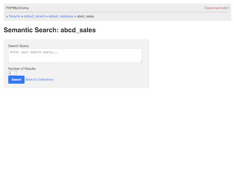

# phpMyChroma

**phpMyChroma** is a tiny PHP 8+ web client that lets you:

- Browse ChromaDB tenants → databases → collections → documents
- Add / Edit / Deletion of  databases → collections → documents
- Semantic Search of documents with in a collection


## ⚡️ Quick start

```bash

git clone https://github.com/pari/phpMyChroma.git

cd phpMyChroma

vim .env   # update OPENAI_API_KEY

docker compose up


```

Open http://localhost:8080 in your browser 


## 🖥️ ScreenShots

[](https://github.com/pari/phpMyChroma/blob/main/screenshots/Screenshot_Collections.png?raw=true)
[](https://github.com/pari/phpMyChroma/blob/main/screenshots/Screenshot_Databases.png?raw=true)
[](https://github.com/pari/phpMyChroma/blob/main/screenshots/Screenshot_ListDocuments.png?raw=true)
[](https://github.com/pari/phpMyChroma/blob/main/screenshots/Screenshot_SemanticSearch.png?raw=true)


## 🛡 License

This project is licensed under the terms of the `MIT` license. See LICENSE for more details.

